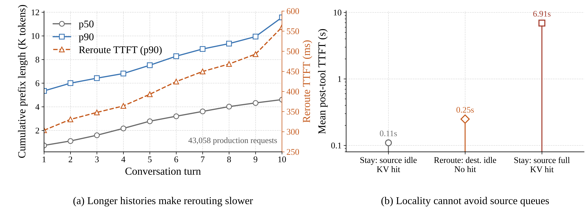

# AgentShift: Execution Mobility for Suspended LLM Agents

## Abstract

LLM agents alternate between model inference and external tools. After an LLM turn completes, an agent may wait hundreds of milliseconds for a tool while its accumulated prefix remains cached on one serving engine. This *suspended-but-warm* state creates a placement conflict: sticky routing preserves the prefix but concentrates returning agents on their previous engines, whereas rerouting relieves load but reconstructs the prefix. Existing routing, retention, offload, and active-request migration mechanisms do not transfer a suspended agent's warm state together with the right to execute its next turn.

AgentShift makes suspended agent executions mobile across identical LLM engines. It separates a durable agent continuation from reconstructable KV state, transfers and atomically installs the completed prefix on a destination, and commits an epoch-fenced ownership handoff during the blocked interval. The destination can therefore resume with a full prefix hit, while the old engine cannot advance the same agent. A source shadow provides low-cost recovery until the destination produces its first token.

We implement AgentShift in SGLang and evaluate Qwen3-8B and Qwen3-32B with tensor parallelism up to four and prefixes up to 130K tokens. With a 250 ms gap, AgentShift relocates a 130K prefix with a full hit and reduces post-tool latency by 132.30x and 75.54x over rerouting for the two models, respectively; it remains within 5.3 ms of Sticky. In an eight-agent 32K burst, it relocates half the owners and is 7.63x faster than rerouting. Warm-pool scale-in is 6.43x faster than semantic rerouting. Within our fault model, epoch fencing prevents double advancement and source-shadow recovery is 10.9x faster than reconstruction.

## 1 Introduction

Long-lived LLM agents execute a sequence of model turns separated by external events. A coding agent may generate a command, wait for a compiler, inspect the result, and then issue another LLM request whose prompt contains the full interaction history. Serving systems exploit this continuity by retaining the completed prefix KV cache and routing the next turn back to the same engine. This policy avoids historical prefill, but it also binds future computation to the engine that holds the cache.

Tool execution exposes a state that request-oriented serving does not model: the agent is *suspended but warm*. Its previous LLM request has finished, no decode request is active, and the agent cannot make progress until the tool completes. Nevertheless, its completed prefix, logical continuation, pending tool result, and future execution placement remain live. Real traces show that this state matters: 29.3% of 245,555 Kimi K2.5 requests contain at least 16K input tokens and 12.5% contain at least 32K. In FlowPrefill sessions, the 90th-percentile prefix grows from 5.3K tokens at the first turn to 11.6K at the tenth. Long-lived agents therefore accumulate increasingly expensive state while repeatedly entering intervals in which they cannot execute.

Suspended warm state creates a locality--placement conflict. Sticky routing preserves locality, but correlated tool completions can return many agents to one engine while another engine is idle. Least-loaded rerouting uses the idle engine, but it reconstructs every historical token there. TTL retention and source-side offload preserve or reclaim memory on the original engine [@continuum; @tokencake]; shared KV tiers can make state available elsewhere [@symphony]. None of these mechanisms alone transfers the agent's continuation and future execution authority. Active-request migration systems instead move a request that is currently executing [@llumnix]. During this interval, no such request exists.

> **Figure 1: Growing agent state creates a locality--placement dilemma.** (a) Across 43,058 production requests, the p90 prefix grows from 5.3K to 11.6K tokens; the right axis maps these prefixes to Qwen3-32B TP=4 reroute TTFT by interpolating measured 4K--32K points. (b) For a 4K warm agent, staying on an idle source takes 0.11 s, rerouting to an idle destination takes 0.25 s and loses the KV hit, and staying on a source whose 16 running slots are occupied takes 6.91 s despite a full hit. Values are means across three latency or five queue repeats.

Figure 1 shows why neither existing placement choice is robust. In the production trace, the p90 reusable prefix grows from 5.3K tokens at the first turn to 11.6K tokens by the tenth; measured Qwen3-32B reroute TTFT at those prefixes rises from 0.30 to 0.56 s. Keeping state local avoids that reconstruction only while the source has capacity. With a fixed 4K prefix and a full cache hit, one warm agent takes 0.11 s on an idle source but 6.91 s when 16 ongoing decodes occupy all 16 running slots. Rerouting it to the idle destination takes 0.25 s but loses the cache hit.

This creates a locality--placement dilemma. Keeping an agent on its previous engine preserves prefix reuse but constrains load balancing and scale-in. Rerouting changes placement, but its cost grows with the agent's accumulated history. Request-level routing therefore cannot freely redistribute long-running agents without either preserving historical placement or paying repeated re-prefill.

Tool-using agents provide an opportunity to escape this dilemma. After a model turn completes, the agent often waits for an external operation. During this interval, its completed prefix is immutable and the next model request has not yet arrived, allowing the serving system to prepare the prefix at another engine before the agent resumes.

The problem is therefore not merely how to copy KV tensors. A correct relocation must satisfy four requirements. The next turn must execute on a different engine; it must obtain a full prefix hit; transfer should finish before the tool makes the agent runnable; and at most one executor may advance each agent step. Copying only KV leaves ownership ambiguous. Moving only control state causes destination re-prefill. Starting the copy after tool return exposes migration on the next turn's critical path.

AgentShift treats the completed-turn boundary as a semantic handoff point. At this boundary, the prefix is immutable and the agent cannot execute, which makes background transfer both cheaper and easier to order than arbitrary live migration. AgentShift first records a durable continuation containing committed progress, the current owner and epoch, pending tool state, output position, and managed-effect status. It then pins the source prefix, reserves destination KV slots, copies tensor-parallel shards, and publishes the destination entry only after every rank and layer completes. Finally, it atomically changes the owner epoch and rebinds the tool mailbox. The old owner loses authority at commit; its KV shadow remains until the destination emits a first-token acknowledgement.

This design turns an otherwise idle tool interval into migration slack. At 130K tokens and a 250 ms gap, AgentShift completes the next Qwen3-8B and Qwen3-32B turns in 83.5 and 156.7 ms, compared with 11.052 and 11.837 s after stateless rerouting. Both destinations report full-prefix hits. In an eight-agent 32K simultaneous return, AgentShift moves half the owners and completes in 730.9 ms, compared with 5579.8 ms for rerouting and 1250.4 ms for on-return migration. Locality-only policies can approach the same latency only by leaving future execution on the source.

AgentShift also exposes a useful elasticity primitive. A model-loaded target is not useful to a warm agent until its state and execution authority are ready. In our warm-pool experiments, AgentShift relocates half of eight agents during scale-out and drains all eight owners during scale-in without historical prefill. This capability complements model-loading systems such as BlitzScale and ServerlessLLM [@blitzscale; @serverlessllm]; it does not replace cold model provisioning.

This paper makes three contributions:

1. **Agent continuation and ownership.** AgentShift separates authoritative progress and managed effects from executor-local acceleration state. Epoch-based ownership and step claims permit one executor to advance an agent, including across tool-result races and recovery.
2. **Completed-prefix mobility.** AgentShift transfers and atomically installs an immutable completed prefix across identically configured SGLang engines. It preserves full prefix hits for Qwen3-8B and Qwen3-32B, tensor parallelism 1--4, and prefixes up to 130K tokens.
3. **Gap-aware semantic handoff.** AgentShift overlaps prefix transfer with tool-induced blocking, commits ownership only after destination readiness, and retains a source shadow until first-token acknowledgement. The result combines sticky-like next-turn latency with changed future placement.

## 2 Background and Motivation

### 2.1 Cross-Turn State Creates Placement Stickiness

An autoregressive LLM stores one key and one value vector per cached token, layer, and attention head. Multi-turn agents repeatedly reuse nearly their entire history, so a completed prefix can represent gigabytes of GPU memory and hundreds of milliseconds of avoided prefill. SGLang's RadixAttention [@sglang] shares such prefixes through a radix tree and naturally favors routing the next turn to the engine containing the longest match.

This optimization couples locality to placement. Let agent $a$ finish a turn on source engine $s$ with completed prefix $P_a$. While $a$ waits for a tool, $P_a$ is useful but no request consumes compute. If the next turn remains on $s$, it receives a full hit but joins $s$'s queue. If it moves to destination $d$, a stateless router reconstructs $P_a$ before decoding. The penalty increases with agent age because $|P_a|$ grows across turns.

Our public traces establish long contexts and cross-turn growth, but do not directly label the fraction of time agents are blocked. Kimi K2.5 contains request input lengths but no session identifiers. FlowPrefill contains parent-linked turns but does not label inter-turn deltas as tools. Figure 2 therefore remains a required labeled-runtime measurement rather than inferring lifecycle states from either trace.

> **Figure 2 placeholder---labeled lifecycle experiment (TODO).** Left: stacked time in `LLM_RUNNING`, `TOOL_BLOCKED`, `READY`, and `FINISHED` for coding and function-calling agents. Right: blocked-agent KV GiB and GPU compute utilization over time. Collect runtime timestamps; do not derive these states from Kimi or FlowPrefill.
>
> *Caption:* The experiment must quantify when agents cannot use GPU compute yet retain KV that couples future execution to one engine.

FlowPrefill nevertheless shows that mobility becomes more valuable as an agent ages. Its 90th-percentile cumulative prefix grows from 5.3K tokens at turn one to 11.6K at turn ten. Our system sweep independently measures the consequence: stateless relocation cost grows with the prefix, whereas a completed-prefix hit keeps next-turn latency near the source-local floor.

> **Figure 3 placeholder---agent aging experiment.** Panel (a): FlowPrefill turn index versus cumulative prefix p50/p90/p99. Panel (b): prefix length 4K--130K versus measured stateless reroute cost for Qwen3-8B and Qwen3-32B. Use Arial and min--max error bars.
>
> *Caption:* Agent state grows across turns, and the cost of reconstructing that state grows with it.

Placement stickiness is most harmful when blocked agents become runnable together. In FlowPrefill, 500 ms child-arrival windows contain five arrivals at p99 and eight at maximum. These arrivals are return proxies, not labeled tool completions.

> **Figure 4 placeholder---correlated-return experiment.** Left: CDF of child arrivals per 10/50/100/500 ms FlowPrefill window. Right: one controlled return timeline, colored by source engine, with source queue depth below it. Mark trace arrivals as proxies.
>
> *Caption:* Return opportunities cluster in short windows, amplifying the queue of the engine that retains the corresponding prefixes.

### 2.2 Existing Actions Leave a Capability Gap

Existing serving mechanisms expose three relevant actions. Routing selects an engine for the next request. Residency management retains, evicts, offloads, or prefetches KV. Request migration moves an active inference request. These actions are valuable, but none defines how a suspended agent transfers both its warm prefix and its right to continue.

Table 1 states the capability boundary. Sticky, Continuum-style TTL, and TokenCake-style source reload preserve locality only while execution remains on the source. Stateless rerouting changes placement but loses the prefix. Shared prefetch can make KV available at a destination, but state availability alone does not fence a stale source. Llumnix migrates active requests; the completed-turn interval has no active request to migrate. On-return handoff satisfies state and ownership requirements, but begins only when the agent is already runnable.

| Design | Moves next turn | Full prefix hit | Prepares in gap | Durable owner transfer |
|:--|:--:|:--:|:--:|:--:|
| Sticky | No | Yes | N/A | No |
| Continuum-style TTL | No | Until expiry | No | No |
| TokenCake-style source reload | No | Yes | Yes | No |
| Stateless reroute | Yes | No | N/A | Routing only |
| Symphony-style shared prefetch | Yes | Yes | Yes | No |
| Llumnix active migration | Yes | Yes | N/A | Request scoped |
| On-return handoff | Yes | Yes | No | Yes |
| **AgentShift** | **Yes** | **Yes** | **Yes** | **Yes** |

: Capability comparison. Literature-named baselines in our experiments are mechanism-equivalent implementations, not official artifact reproductions. {#tab:capabilities}

The fair objective is consequently constrained. AgentShift minimizes post-tool latency subject to destination execution, a full prefix hit, and single-owner progress. Locality-only baselines provide a latency floor but do not satisfy destination execution. Stateless rerouting provides a load-balancing reference but not a locality-preserving alternative. On-return migration is the closest controlled baseline because it uses the same engines, tensors, transport, installation, and ownership protocol; only its start time differs.

### 2.3 Design Principles

AgentShift follows two principles. First, durable progress is authoritative. A database record determines the committed step, owner, epoch, pending tool, stream position, and managed effects. Executor memory cannot overrule it. Second, KV is reconstructable acceleration state. A prefix may be copied, shadowed, or discarded without changing agent semantics, provided it is never made visible before complete installation and recovery preserves one valid owner.

These principles separate correctness from performance. Ownership commit decides who may execute. Prefix installation decides whether that execution is fast. A source shadow improves recovery latency but is not the source of truth. This separation lets AgentShift abort safely before commit, recover deterministically after commit, and fall back to reconstruction when no warm copy survives.

## 3 AgentShift Overview

AgentShift operates between two completed LLM turns. The source and destination run the same model revision, tokenizer, KV layout, and tensor-parallel degree. The current prototype targets multi-head attention and identical tensor-parallel rank mappings. These compatibility constraints allow direct shard-preserving copies; heterogeneous layouts would require KV transformation.

Figure 5 shows the handoff. When an agent blocks on a tool, the runtime records the pending future in the continuation store. The mobility controller selects a destination, pins the source prefix, reserves destination slots, and starts an asynchronous rank-to-rank copy. Each destination rank validates the complete token key and reports readiness only after all layers are installed. The controller then performs one compare-and-swap from $(s,e)$ to $(d,e+1)$ and rebinds the mailbox. A tool result arriving before or after this operation is consumed by the owner of the current epoch.

> **Figure 5 placeholder---system architecture.** Four layers: agent runtime; continuation/mailbox/effect store; mobility controller; source and destination SGLang engines. Solid arrows move KV, dashed arrows carry readiness/CAS, and the mailbox delivers the tool result to the committed owner.
>
> *Caption:* AgentShift coordinates durable continuation, completed-prefix state, and execution authority at a completed-turn boundary.

The protocol has two safety invariants. **Single advancement:** for every $(agent, step)$, at most one current-epoch executor may claim and advance the step. **Atomic visibility:** a destination prefix is not visible to lookup until every required tensor-parallel shard and layer has been installed under the exact token key. Together, these properties prevent a partial cache entry from being consumed and prevent two valid executors from using two complete copies.

The ownership CAS is the commit boundary. Before commit, the source remains authoritative and a failed preparation is discarded. After commit, the destination is authoritative even if the source still holds a shadow. If the destination fails before its first token, the controller increments the epoch and recovers from the source shadow. Once first-token acknowledgement releases the shadow, failure recovery remains correct but may reconstruct the prefix.

> **Figure 6 placeholder---semantic handoff sequence.** Swimlanes: runtime, controller/store, source, destination, tool. Shade the blocked gap; show pin, reserve, async copy, all-rank `DEST_READY`, owner CAS as the commit point, mailbox rebind, tool completion, next-turn claim, first-token ACK, and source release.
>
> *Caption:* AgentShift prepares acceleration state before transferring authority and retains the source shadow until useful destination execution.

## 4 Agent Continuation and Ownership

Moving an agent requires a durable description of what may happen next. AgentShift represents this description as an `AgentContinuation`: agent identifier, committed step, owner engine, monotonic owner epoch, complete token IDs, pending future identifier, workspace reference, output stream offset, and application metadata. This record is intentionally smaller than a process checkpoint. AgentShift does not move a Python stack, shell, browser, or tool process; it records the logical state needed to issue the next model turn after the external result becomes available.

### 4.1 Epoch-Fenced Execution

Every inference turn carries an owner pair $(engine, epoch)$. Before sending work to SGLang, the managed executor compares this pair with the durable continuation and claims the next $(agent, step)$ under a unique request identifier. A uniqueness constraint admits one live claim. Completion atomically records the new token continuation and marks the claim complete. Requests from an old engine or epoch fail before inference, and retries with a conflicting request identifier fail before a second step can be advanced.

Ownership changes only through a compare-and-swap. For a migration from source $s$ at epoch $e$ to destination $d$, the store accepts the update only if the migration is `DEST_READY` and the continuation still names $(s,e)$. A successful transaction sets the owner to $(d,e+1)$ and the migration to `COMMITTED`. This ordering gives each engine a simple rule: an executor may act only while its pair equals the durable owner pair.

The protocol uses epochs rather than a boolean owner flag because recovery is also an ownership change. If $d$ fails after commit, recovery advances to epoch $e+2$ on the selected recovery engine. Delayed work from both $s@e$ and $d@(e+1)$ is then stale. The protocol does not depend on synchronized clocks; ordering comes from store transactions and monotonic epochs.

### 4.2 Tool Results and Managed Effects

A global mailbox decouples tool completion from engine placement. Tool results are keyed by $(agent, step, future)$ and inserted idempotently. The current-epoch owner reads the result after claiming the next step. A result that races the ownership CAS therefore remains available without requiring the tool process to know the destination.

External side effects require a narrower contract. Operations routed through AgentShift receive a stable operation identifier and move through `PREPARED`, `SUBMITTED`, `COMPLETED`, or `UNKNOWN`. The proxy records `SUBMITTED` before invoking the external operation. It returns a stored result for a completed retry, and it refuses to replay a submitted or unknown operation automatically. This provides at-most-once submission for managed effects; it does not provide exactly-once semantics for arbitrary third-party tools.

### 4.3 Abort, Recovery, and Restart

The migration state machine separates preparation from authority. `PREPARING`, `COPYING`, and `DEST_READY` are pre-commit states, so the source retains ownership. A failed copy marks the migration `ABORTED`, returns uninstalled destination reservations, and leaves the source prefix pinned only until cleanup completes. A controller restart can inspect durable state, wait for a still-active copy, or abort an uncommitted destination without changing the owner.

`COMMITTED` is the only post-commit state before source release. The destination owns future progress, while the old prefix remains a non-authoritative shadow. Destination first-token acknowledgement releases this shadow and changes the migration to `SOURCE_RELEASED`. A lost acknowledgement is harmless because release is idempotent and restart reconciliation observes the durable owner. Multiple acknowledgements to one source are serialized because SGLang's tokenizer control communicator permits one in-flight RPC per operation.

Recovery preserves correctness even without a warm copy. Before source release, the controller can rebind the shadow to epoch $e+2$ and resume with a full hit. After release, the same durable ownership transition chooses a recovery engine, but the engine reconstructs the prefix from token IDs. The shadow therefore reduces recovery cost; the continuation and epoch protocol provide correctness.

> **Figure 7 placeholder---handoff and recovery state machine.** Show `PREPARING -> SOURCE_PINNED -> DEST_RESERVED -> COPYING -> DEST_READY -> COMMITTED -> FIRST_TOKEN -> SOURCE_RELEASED`, plus `ABORTED`. Color pre-CAS states source-owned and post-CAS states destination-owned; add crash and restart arrows.
>
> *Caption:* Every durable state has one authoritative owner and one cleanup or recovery action.

## 5 Completed-Prefix Mobility

Completed-prefix mobility turns engine-local KV into movable acceleration state. For a prefix of $n$ tokens, $L$ transformer layers, $h_{kv}$ KV heads, head dimension $d$, and element width $b$, the unsharded MHA payload is $2nLh_{kv}db$ bytes. AgentShift preserves the existing tensor-parallel sharding, so each source rank sends its local rows directly to the corresponding destination rank.

### 5.1 Source Pinning and Destination Reservation

The source first validates the full token key against a resident RadixCache node and increments the node's lock reference. Pinning prevents normal LRU eviction during transfer. The current implementation uses page-aligned completed turns; the continuation records the exact token sequence so the destination cannot install a semantically different prefix under the agent identifier.

The destination reserves request-to-token and token-to-KV slots before receiving data. It may evict only unlocked cache entries. Reserved slots remain visible to SGLang's pool invariant checker even though they are not yet visible to prefix lookup. If capacity is unavailable, preparation fails before ownership changes.

### 5.2 Rank-to-Rank Copy and Atomic Installation

Corresponding source and destination TP ranks join persistent two-rank NCCL groups. A bounded worker copies one layer at a time on a separate CUDA stream, allowing scheduler RPCs to return while the data plane proceeds. The controller polls both engines; each engine aggregates status across its TP CPU group and reports the least advanced rank. Any rank failure fails the operation.

The destination installs the RadixCache entry only after all K/V rows have arrived. Installation inserts the exact complete token key and transfers allocation ownership to the normal cache lifecycle. This implements the visibility invariant:

$$
visible(P_a,d) \Rightarrow \bigwedge_{r \in TP}\bigwedge_{l \in layers} installed(P_a,d,r,l).
$$

A successful transfer retains installed rows when temporary transfer records are cleaned. A failed transfer frees reservations that never became visible. This distinction avoids both leaking failed allocations and reclaiming a valid cache entry after success. Migration-scoped readiness does not weaken atomic visibility: a partially received reservation is addressable only through its migration identifier, never through ordinary RadixCache lookup. Section 6.3 uses this private view to execute ready layer groups, but fences cache publication, token output, and ownership change until complete installation and commit.

> **Figure 8 placeholder---completed-prefix mobility.** Draw source and destination TP ranks as aligned columns. Show pinned source blocks, reserved destination blocks, layer-wise K/V copy, exact token-key validation, an all-rank barrier, and one atomic RadixCache install. Cross out a partially visible destination node.
>
> *Caption:* A destination prefix becomes visible only after every required rank and layer is installed.

### 5.3 Why Completed Turns

The completed-turn boundary removes write races from the data path. Unlike live request migration, the prefix does not grow during transfer, so AgentShift needs neither iterative dirty-state copying nor a decode pause. Unlike a shared KV store, the destination receives its normal local RadixCache representation and can immediately use the serving engine's existing prefix lookup path.

This scope is deliberate. AgentShift does not migrate active decode, speculative draft KV, MLA state, Mamba state, or heterogeneous TP layouts. These cases require different consistency or transformation mechanisms. The current abstraction targets the interval common to tool-using agents: immutable model state, pending external work, and no active request.

## 6 Gap-Aware Semantic Handoff

Completed-prefix mobility removes re-prefill but does not by itself remove migration latency. If a copy starts only after the tool returns, the entire transfer delays the next turn. AgentShift starts preparation while the agent cannot execute. For migration time $T_m$ and remaining blocked interval $T_g$, the copy contribution exposed after tool return is

$$
T_{exposed}=\max(0,T_m-T_g).
$$

### 6.1 Eligibility and Placement

Only blocked agents with a completed resident prefix and no unresolved managed effect are eligible. The destination must use a compatible engine configuration and have enough free KV slots. AgentShift estimates copy time as a fixed setup cost plus KV bytes divided by measured bandwidth. It rejects candidates whose estimated exposure exceeds a configured budget.

The prototype uses an explainable cost-benefit score rather than a learned predictor. For agent $a$ and destination $d$, positive terms estimate source queue relief, avoided re-prefill, and pressure-weighted HBM relief. Negative terms estimate interference and exposed copy time:

$$
Score(a,d)=Q_{relief}+\lambda R_{saved}+\mu H_{relief}
-\nu I_{copy}-\rho T_{exposed}.
$$

The controller ranks positive candidates, reserves destination capacity, selects at most one destination per agent, and enforces a migration-concurrency limit. When admitted agents share a serial transfer channel, it considers them by return deadline; if cumulative handoff cost exceeds a deadline, it defers the longest handoff in the current set. This admissible-first order maximizes the predicted number prepared before return, rather than minimizing the tail of every agent. Exact tool completion prediction is not a correctness requirement. Prediction affects whether a copy finishes in the gap and whether its cost is worthwhile.

### 6.2 Handoff Ordering

The data plane and authority plane meet at `DEST_READY`. AgentShift starts destination receive before source send, waits for all-rank completion, cleans transfer bookkeeping, and persists `DEST_READY`. Only then does it commit the ownership CAS. This sequence prevents an owner from reaching a destination whose prefix is incomplete.

Tool completion does not interrupt a copy or bypass the owner check. On the default path, an early result waits in the mailbox and the next turn incurs the remaining transfer delay. The progressive path in Section 6.3 may instead use that result in a migration-scoped private continuation, but it cannot publish output or advance the durable step before the same ownership CAS. If preparation fails, the private result is discarded and the source remains owner. If commit wins the race, the destination publishes the result under the new epoch.

The current NCCL path serializes migrations within one coordinator because point-to-point messages are untagged and source and destination queue order must match. The policy may admit multiple migrations, but the evaluated data path drains them through this bounded channel. Multiple tagged groups or an RDMA backend are future transport improvements, not changes to the semantic protocol.

### 6.3 Adaptive Layer-Group Selection

A full-transfer barrier is unnecessarily conservative when the tool returns before `DEST_READY`. The destination can execute a migration-scoped continuation one layer group at a time: transfer group $j$ records a CUDA event after its final byte arrives, and the split forward for group $j$ waits for both this event and the hidden state produced by group $j-1$. Smaller groups expose state earlier, but increase event publication, scheduler wakeup, and split-forward overhead. Larger groups amortize this overhead, but delay the first useful state. AgentShift therefore selects granularity by predicted completion time rather than by a fixed layer count or a bandwidth threshold.

Let the model contain the ordered layer set $\mathcal{L}=\{1,\ldots,L\}$. For workload $w$, layer $i$ contributes $s_i(w)$ transferable bytes and $c_i(w)$ seconds of destination computation. The controller maintains an effective bandwidth estimate $\widehat{B}$, per-message latency $\widehat{\ell}$, queued-link delay $\widehat{q}$, and fixed group activation cost $\widehat{h}$. If layer $i$ requires $m_i$ transport messages, its predicted transfer service time is

$$
x_i(w)=m_i\widehat{\ell}+\frac{s_i(w)}{\widehat{B}}.
$$

For a candidate group size $g$, let $\mathcal{I}^{g}_j$ be the $j$-th consecutive layer group and $M_g=\lceil L/g\rceil$. Transfer and compute form a two-stage flow shop. Relative to migration start, group-transfer completion $R^g_j$ and private-compute completion $F^g_j$ obey

$$
R^g_0=\widehat{q},\qquad
R^g_j=R^g_{j-1}+\sum_{i\in\mathcal{I}^{g}_j}x_i(w),
$$

$$
F^g_0=\tau,\qquad
F^g_j=\max\!\left(R^g_j,F^g_{j-1}\right)
       +\sum_{i\in\mathcal{I}^{g}_j}c_i(w)+\widehat{h},
$$

where $\tau$ is the predicted release time of the tool result and continuation tokens. The predicted post-tool latency is $J(g)=F^g_{M_g}-\tau$. For comparison, waiting for the complete transfer has predicted latency

$$
J_{\mathrm{wait}}=
\max\!\left(R^g_{M_g},\tau\right)+C_{\mathrm{full}}(w)-\tau,
$$

where $C_{\mathrm{full}}(w)$ is the measured unsplit continuation cost. Algorithm 1 evaluates a small candidate set $\mathcal{G}$ that always includes $L$. It chooses the coarsest candidate within an $\epsilon$-neighborhood of the minimum, which avoids unstable switching when adjacent group sizes differ only within profiling error. Progressive execution is disabled unless its predicted advantage exceeds gain threshold $\delta$.

\begin{algorithm}[t]
\caption{Online Adaptive Layer-Group Selection}
\label{alg:adaptive-layer-group}
\begin{algorithmic}[1]
\Require Layer profiles $\{s_i(w),c_i(w),m_i\}_{i=1}^{L}$; link profile $(\widehat{B},\widehat{\ell},\widehat{q})$; release time $\tau$; activation cost $\widehat{h}$; candidate set $\mathcal{G}$; tolerances $\epsilon,\delta\in[0,1)$
\Ensure Execution mode $z\in\{\textsc{Wait},\textsc{Progressive}\}$ and selected group size $g^{\dagger}$
\State $\mathcal{G}\gets\mathcal{G}\cup\{L\}$
\ForAll{$g\in\mathcal{G}$}
    \State $M_g\gets\lceil L/g\rceil$, $R^g_0\gets\widehat{q}$, and $F^g_0\gets\tau$
    \For{$j=1,\ldots,M_g$}
        \State $\mathcal{I}^{g}_j\gets\{(j-1)g+1,\ldots,\min(jg,L)\}$
        \State $X^g_j\gets\sum_{i\in\mathcal{I}^{g}_j}\left(m_i\widehat{\ell}+s_i(w)/\widehat{B}\right)$
        \State $C^g_j\gets\sum_{i\in\mathcal{I}^{g}_j}c_i(w)+\widehat{h}$
        \State $R^g_j\gets R^g_{j-1}+X^g_j$
        \State $F^g_j\gets\max\{R^g_j,F^g_{j-1}\}+C^g_j$
    \EndFor
    \State $J(g)\gets F^g_{M_g}-\tau$
\EndFor
\State $J_{\min}\gets\min_{g\in\mathcal{G}}J(g)$
\State $\mathcal{A}_{\epsilon}\gets\{g\in\mathcal{G}:J(g)\le(1+\epsilon)J_{\min}\}$
\State $g^{\dagger}\gets\max\mathcal{A}_{\epsilon}$
\State $J_{\mathrm{wait}}\gets\max\{R^{g^{\dagger}}_{M_{g^{\dagger}}},\tau\}+C_{\mathrm{full}}(w)-\tau$
\If{$J(g^{\dagger})>(1-\delta)J_{\mathrm{wait}}$}
    \State \Return $(\textsc{Wait},L)$
\Else
    \State \Return $(\textsc{Progressive},g^{\dagger})$
\EndIf
\end{algorithmic}
\end{algorithm}

The selector is training-free and costs $O(|\mathcal{G}|L)$ time and $O(|\mathcal{G}|)$ auxiliary space. AgentShift obtains $s_i(w)$ from the actual destination reservation, including prefix length, element width, and TP-local layout. It indexes $c_i(w)$ by model, tensor-parallel degree, continuation size, and load bucket. After each handoff, exponentially weighted observations update $\widehat{B}$, $\widehat{q}$, $\widehat{h}$, and the layer-compute profile. Consequently, KV volume, link contention, and foreground load affect the same completion-time objective rather than entering as independent hand-written rules.

### 6.4 Warm-Pool Elasticity

Semantic handoff makes model-ready capacity useful to existing warm agents. During warm scale-out, the controller can move blocked owners to an already loaded engine before their next turns arrive. During scale-in, an engine enters `DRAINING`: it receives no new owners and hands off resident agents at completed-turn boundaries until its owner count reaches zero.

This primitive decomposes useful capacity into three events. A target is **model-ready** when its weights can execute requests, **state-ready** when the selected prefix is locally installed, and **authority-ready** when the ownership CAS has committed. Cold-start systems accelerate the first event [@blitzscale; @serverlessllm]. AgentShift connects the latter two for long-lived agents. Our evaluation therefore measures warm-pool elasticity and does not claim cold autoscaling.

## 7 Implementation

We implement AgentShift as a Python control plane and a modified SGLang data plane. The control plane stores continuations, migrations, mailboxes, step claims, and managed effects in SQLite with write-ahead logging and full synchronous commits. It exposes a managed executor, an asynchronous migration coordinator, placement policies, and mechanism-equivalent baseline coordinators. SQLite gives the prototype a concrete durable commit point; the protocol does not depend on SQLite-specific ordering beyond transactional compare-and-swap.

The data-plane changes extend SGLang's RadixCache and KV allocator with pin, reserve, transfer, install, release, and epoch-rebind operations. HTTP control endpoints enqueue operations and return status. Persistent NCCL groups connect corresponding tensor-parallel ranks, and an independent CUDA stream performs layer-wise BF16 K/V copies. In progressive mode, the receive worker records one CUDA event per selected group and the scheduler invokes SGLang's split-forward path only after that group's TP-wide readiness. The original all-layers barrier remains the default path. Rank-local results are aggregated before the controller observes completion.

The implementation is based on SGLang commit `034dd39189ba1ace1308d3c8a58df275ef301a21`. We test Qwen3-8B and Qwen3-32B with TP=1, 2, and 4. The supported path uses MHA, RadixCache, page-aligned completed prefixes, identical model revisions, and identical TP layouts on one eight-H100 node. CUDA Graph is disabled consistently across compared strategies.

Implementation testing exposed two lifecycle races. First, concurrent first-token acknowledgements issued overlapping release RPCs to one engine; per-source locks now serialize those releases. Second, cache flush could reset RadixCache while AgentShift retained pinned-prefix metadata; flush now rejects active transfers and clears the registry before reset. These fixes illustrate why prefix mobility must participate in the serving engine's allocation lifecycle rather than copy tensor addresses out of band.

## 8 Evaluation

Our evaluation asks seven questions:

1. Does AgentShift preserve locality after changing placement?
2. How much migration can a blocked interval hide?
3. Does semantic handoff relieve a return hotspot?
4. Can it provide useful warm-pool elasticity?
5. How much does transfer interfere with foreground inference?
6. Does the protocol recover without double advancement?
7. How does the prototype generalize and where does its control plane saturate?

### 8.1 Experimental Setup

We run two SGLang engines on one server with eight NVIDIA H100 80 GB GPUs connected by NVLink. The main matrix uses Qwen3-8B in BF16 with TP=1 on GPUs 0 and 1. Each engine allocates 270K KV tokens and uses FA3 attention, FlashInfer sampling, page size one, and 4096-token chunked prefill. We also test Qwen3-8B at TP=2 and Qwen3-32B at TP=4. For the 130K stress test, the models' native 32,768-token context is extended to 131,072 with the official YaRN 4x configuration; the installed prefix is 130,004 tokens. The software stack uses PyTorch 2.10, CUDA 12.8, NCCL 2.27.5, and our SGLang fork at commit `034dd3918`.

All strategies use the same weights, prompts, output lengths, engines, and KV layout. Scenario order is randomized where supported, and transfer groups and tier allocators are warmed outside timed regions. Five repetitions support headline comparisons; wider matrices use three. CUDA Graph is disabled for every strategy, so relative comparisons are aligned but absolute latency requires production-graph revalidation.

We compare four primary mechanisms. **Sticky** runs the next turn on the source and defines the locality floor. **Reroute** sends the next turn to the destination without KV and reconstructs history. **On-return** uses AgentShift's direct transfer, installation, and ownership protocol but starts after the tool returns. **AgentShift** starts the same handoff at tool submission. **Oracle** is a timing upper bound that knows the gap.

We also implement three literature-inspired design points in the same SGLang testbed. **TTL** is calibrated from coding-tool durations and retains state on the source until expiry. **TokenCake-Source** offloads KV to host memory and reloads it to the source during the gap. **Shared prefetch** stages KV through local shared memory and imports it at the destination, with and without AgentShift's ownership CAS. These are mechanism-equivalent implementations, not official Continuum, TokenCake, or Symphony artifacts.

| Setting | Tool class | Representative operation | Blocked turns | Wait p50 / p90 (ms) | Prefix p50 / p90 (K tokens) | Covered |
|:--|:--|:--|--:|--:|--:|--:|
| Coding, TP=1 | Shell | `git status --short` | 18 | 5.0 / 11.9 | 24.0 / 32.0 | 0% |
|  | Targeted test | `pytest` state store | 18 | 426.8 / 434.7 | 24.0 / 32.0 | 100% |
|  | Targeted test | `pytest` migration protocol | 18 | 504.1 / 510.3 | 24.0 / 32.0 | 100% |
|  | Build/test | `pytest` full suite | 18 | 623.4 / 628.4 | 24.0 / 32.0 | 100% |
|  | **Overall** | All operations | 72 | 437.2 / 624.1 | 24.0 / 32.0 | 75% |
| Representative, TP=2 | Web search | OpenAlex query | 24 | 1649.8 / 2614.5 | 16.0 / 32.0 | 100% |
|  | Page fetch | HTTP fetch + HTML parse | 24 | 709.2 / 2328.4 | 16.0 / 32.0 | 100% |
|  | External API | Open-Meteo request | 24 | 1078.4 / 1184.4 | 16.0 / 32.0 | 100% |
|  | PDF parsing | Parse up to 12 pages | 24 | 1074.9 / 1518.6 | 16.0 / 32.0 | 100% |
|  | Python execution | AST/JSON/hash/sort | 24 | 270.3 / 364.0 | 16.0 / 32.0 | 100% |
|  | **Overall** | All operations | 120 | 1025.1 / 2045.8 | 16.0 / 32.0 | 100% |

: Blocking intervals observed after a completed Qwen3-8B turn. `Covered` compares each interval with p95 completed-prefix preparation time measured under the matching TP configuration. Representative rows aggregate four operations over 4K, 16K, and 32K prefixes, each repeated twice. {#tab:tool-gaps}

Table [@tab:tool-gaps] measures two controlled workloads in which each operation starts after a completed model turn. In the coding replay, test operations always cover p95 completed-prefix preparation, whereas the short `git status` operation never does; 75% of its 72 intervals cover preparation. The additional network, document, and local-compute operations have median waits from 270.3 ms to 1.650 s, and all 120 intervals exceed the matching TP=2 preparation threshold of 27.9--48.5 ms. All operations complete successfully and all next turns retain a full prefix hit. This class-balanced sample demonstrates that useful blocking intervals occur across several tool classes; it does not estimate their production frequency.

### 8.2 RQ1: Locality After Placement Change

AgentShift preserves the sticky latency floor after relocation. At 32K tokens and a 500 ms gap, its mean post-tool latency is 52.4 ms, compared with 54.4 ms for Sticky, 126.1 ms for On-return, and 1260.5 ms for Reroute (Table 2). The small difference from Sticky is run noise; both execute the next turn with a full local hit. AgentShift changes owner and placement, whereas Sticky does neither.

| Strategy | Post-tool mean (ms) $\downarrow$ | Full hit | Owner moved |
|:--|--:|:--:|:--:|
| Sticky | 54.4 | Yes | No |
| Reroute | 1260.5 | No | Routing only |
| On-return | 126.1 | Yes | Yes |
| **AgentShift** | **52.4** | **Yes** | **Yes** |
| Oracle | 54.5 | Yes | Yes |

: Next-turn latency for Qwen3-8B, TP=1, 32K prefix, 500 ms gap, and five repetitions. {#tab:headline}

Relocation value grows with accumulated context. Figure 9 sweeps 4K, 16K, and 32K prefixes. AgentShift is 3.08x, 10.61x, and 23.36x faster than Reroute, respectively. The same sweep gives 2.00x, 2.16x, and 2.29x over On-return. Reroute grows with historical prefill; AgentShift remains near the cost of the incremental next turn.

> **Figure 9 placeholder---core performance.** Panel (a): 4K--32K context sweep. Panel (b): 130K Qwen3-8B TP=1. Panel (c): 130K Qwen3-32B TP=4. Annotate full-hit rate and 17.85/31.74 GiB moved; use a log latency axis.
>
> *Caption:* AgentShift preserves a full destination prefix as context, model size, and tensor parallelism grow.

The full prefix moves, not an approximate or partial cache entry. At TP=2, Qwen3-8B AgentShift takes 83.2 ms at 32K, versus 75.4 ms for Sticky and 704.3 ms for Reroute, an 8.46x gain over rerouting. At TP=4, Qwen3-32B takes 120.5 ms, versus 118.7 ms and 1637.3 ms, a 13.58x gain. The destination reports all 32,772 completed-prefix tokens as cached in the 32B run.

The 130K experiment stresses both reconstruction and transfer. Qwen3-8B TP=1 moves 17.85 GiB; with a 250 ms gap, AgentShift takes 83.54 ms, versus 83.31 ms for Sticky, 335.29 ms for On-return, and 11.052 s for Reroute. Qwen3-32B TP=4 moves 31.74 GiB across four ranks; AgentShift takes 156.69 ms, versus 151.40 ms, 373.06 ms, and 11.837 s. These are 132.30x and 75.54x gains over rerouting and 4.01x and 2.38x over On-return. Every migration sample installs and hits all 130,004 tokens.

### 8.3 RQ2: Hiding Transfer in Blocked Gaps

Gap-aware timing provides a benefit distinct from KV mobility. On-return and AgentShift share the same 4.50 GiB 32K transfer, destination installation, and ownership CAS. At a zero-length gap their delays converge. At 100 ms, AgentShift reaches 53.4 ms, compared with 129.5 ms for On-return and 1272.7 ms for Reroute. At 500 ms it reaches 53.9 ms and matches Sticky at 53.6 ms. Figure 10 follows the expected $\max(0,T_m-T_g)$ relationship.

> **Figure 10 placeholder---migration opportunity.** Left: post-tool latency versus 0--1000 ms gap for AgentShift and On-return, plus Sticky and the measured overlap envelope. Right: coverage heatmap by real labeled tool gap, prefix size, and backend; keep cells grey until labeled traces or cross-node data exist.
>
> *Caption:* A blocked interval removes completed-prefix transfer from the critical path when it covers the handoff.

Three real commands confirm both the opportunity and its limit. A `git status --short` invocation lasts 8.9 ms and exposes most of the copy: AgentShift takes 113.2 ms after return, versus 131.5 ms for On-return. State-store and control-plane test commands last 403.4 and 488.2 ms; both fully hide transfer and reduce post-tool latency from 125.4 and 124.8 ms to 54.5 and 54.7 ms. AgentShift therefore needs admission, not an assumption that every tool is long.

The benefit persists across multiple tool turns. We replay eight coding agents for three turns, invoke real subprocess tools, and grow each prefix from 16K to 32K. AgentShift relocates four owners, preserves a full hit for every turn, and completes in 5.002 s. Sticky takes 7.169 s without moving an owner, Reroute takes 6.264 s and reconstructs 65,548 historical tokens, and On-return takes 5.318 s. AgentShift therefore improves makespan by 1.43x, 1.25x, and 1.06x, respectively. Its post-tool p95 is 1.711 s versus 1.708 s for On-return, so proactive overlap does not improve every turn in this controlled replay.

Ordering matters when blocked agents share one transfer stream. We combine six 4K--32K prefixes with decorrelated 60--500 ms gaps and calibrate end-to-end handoff cost using three samples per size. AgentShift's admissible-first order completes 83.3% of handoffs before tool return, compared with 50.0% for FIFO and shortest-KV and 33.3% for earliest-return; all policies retain full hits. AgentShift defers one predicted-late migration, which improves coverage but increases that agent's tail. We therefore optimize and report in-gap coverage separately from exposed latency.

> **Figure 11 placeholder---multi-turn replay and policy.** Left: three-turn coding replay makespan with relocated-owner and full-hit annotations. Right: in-gap completion rate for FIFO, shortest-KV, earliest-return, admissible-first, and oracle; overlay p95 exposed delay.
>
> *Caption:* AgentShift preserves mobility across turns, while admission and ordering determine how many handoffs finish before return.

Trace analysis indicates that long warm prefixes and clustered returns occur, but it does not establish a universal tool-gap distribution. In Kimi K2.5, 29.3% of 245,555 requests have at least 16K input tokens and 12.5% have at least 32K. Across 100K worker records, the median KV hit fraction is 63.3%. In FlowPrefill, the 90th-percentile prefix increases from 5.3K at turn one to 11.6K at turn ten; 500 ms child-arrival windows contain five arrivals at p99 and eight at maximum. FlowPrefill deltas are proxies because the trace does not label tool execution.

### 8.4 RQ3: Correlated-Return Hotspots

AgentShift removes the locality--balance choice in the tested return burst. We warm eight 32K agents on the source, block them for 500 ms, and return them simultaneously. The destination receives half of the next turns. AgentShift completes the burst in 730.9 ms with a full hit for all agents and transfers ownership for the relocated half. Reroute completes in 5579.8 ms and re-prefills 131,088 historical tokens; On-return takes 1250.4 ms.

> **Figure 12 placeholder---hotspot Pareto and queue relief.** Left: post-tool latency versus source-owner relief; filled markers mean full prefix hit and thick outlines mean fencing. Right: source and destination queue depth over time for Sticky, Reroute, On-return, and AgentShift.
>
> *Caption:* AgentShift reaches the low-latency, high-relief region in the eight-agent 32K return burst.

Source-side offload does not solve the same hotspot. TokenCake-Source takes 2196.4 ms in this burst and leaves every next turn on the source. Sticky is fast at 783.7 ms but also moves no owner. AgentShift's 730.9 ms should therefore be read as matching the locality floor while redistributing work, not as a general claim that it makes local execution faster.

TTL shows the same capability boundary under capacity pressure. We calibrate a 491.9 ms TTL from coding-tool measurements, with 88.9% coverage over nine held-out samples. Eight 16K agents compete with twelve 16K pressure requests. At a 400 ms gap, TTL retains all prefixes but leaves all owners on the source; AgentShift moves half and has similar makespan. At a 500 ms gap, TTL expires and preserves only 33% of prefixes. AgentShift retains all prefixes, improves makespan from 8048.6 to 5545.6 ms (1.45x), and improves mean post-tool latency from 6631.1 to 3129.7 ms (2.12x). Retain-or-evict and relocate are different scheduler actions.

Our local shared-memory path is not competitive with direct GPU transfer. At 32K/500 ms, mechanism-equivalent shared prefetch takes 4868.9 ms without ownership and 5241.0 ms with CAS. These numbers diagnose an extra host/shared-tier hop in this implementation; they do not estimate official Symphony. More importantly, adding CAS to shared prefetch shows that AgentShift's semantic protocol can sit above another transport, while direct GPU mobility lowers the data path in our single-node setting.

> **Figure 13 placeholder---alternative design points.** Panel (a): TTL hit rate and makespan versus gap. Panel (b): TokenCake-Source HBM relief versus owner relief. Panel (c): direct GPU handoff versus shared-tier prefetch+CAS latency and bytes. Label every literature-inspired path mechanism-equivalent.
>
> *Caption:* Retention and offload manage residency, and shared prefetch manages availability; these actions do not by themselves provide semantic execution handoff.

### 8.5 RQ4: Warm-Pool Elasticity

AgentShift turns model-ready capacity into warm-agent capacity. In scale-out, we add an already loaded destination and select four of eight 16K agents during a 500 ms gap. AgentShift moves 50% of owners with 100% full hits and no re-prefill. Its post-tool makespan is 0.704 s, compared with 0.894 s for On-return and 2.616 s for semantic rerouting. Sticky takes 0.714 s but activates none of the new capacity.

> **Figure 14 placeholder---warm scale-out.** Stacked readiness timeline from target admission: model-ready, state-ready, authority-ready, and first useful token. Plot Sticky, semantic reroute, On-return, and AgentShift. Model-ready starts at zero; annotate relocated-owner fraction.
>
> *Caption:* AgentShift turns already model-ready capacity into warm-agent capacity without historical prefill.

Scale-in exposes a stronger semantic distinction. AgentShift hands off all eight owners and drains the source in 0.712 s without historical prefill. On-return takes 1.101 s, and semantic rerouting takes 4.583 s while reconstructing 131,104 tokens. Sticky takes 0.710 s but cannot drain: all eight owners remain. Thus AgentShift is 1.55x faster than On-return and 6.43x faster than rerouting among strategies that complete the drain.

> **Figure 15 placeholder---semantic scale-in.** Plot source-owned agents over time after `DRAINING` for Sticky, semantic reroute, On-return, and AgentShift. Mark Sticky `does not drain`; inset re-prefilled tokens and wasted GPU-seconds.
>
> *Caption:* AgentShift drains all eight warm owners without historical prefill; Sticky preserves latency only by retaining every owner.

These results establish stateful warm elasticity, not cold autoscaling. The target model is loaded before timing. A cold deployment would additionally pay weight-loading and engine-initialization cost; BlitzScale-like model provisioning could shorten that phase, after which AgentShift would prepare warm agent state and authority.

### 8.6 RQ5: Foreground Interference

Asynchronous transfer bounds, but does not eliminate, foreground stalls. We overlap one 32K migration with eight streaming decodes and submit a one-token arrival probe 5 ms after transfer begins. Without migration, throughput is 397.7 token/s and arrival TTFT is 53.9 ms. Synchronous transfer lowers throughput to 397.0 token/s and increases TTFT to 78.0 ms. Asynchronous transfer sustains 397.9 token/s and reduces TTFT to 64.5 ms.

> **Figure 16 placeholder---interference and concurrency.** Heatmap foreground load 25/50/75/90% by 1/2/4/8 concurrent migrations, cell=TTFT p99 overhead. Bottom strip=migration p95 and completed-in-gap fraction. Populate the measured one-migration/eight-stream point and grey unmeasured cells.
>
> *Caption:* Asynchronous copy bounds foreground stalls in the measured case; the remaining matrix determines the admission limit.

Steady-state token latency remains similar: TPOT p95 is 20.55 ms without migration, 20.42 ms with synchronous copy, and 20.57 ms with asynchronous copy. The maximum token gap is more sensitive, rising from 41.62 to 66.17 ms under synchronous transfer and to 53.38 ms under asynchronous transfer. Async copy therefore reduces excess arrival TTFT from 24.1 to 10.6 ms and excess maximum token gap from 24.6 to 11.8 ms. This experiment covers one migration; concurrent-copy admission remains a scaling limitation.

| Removed property | Controlled variant | Observed consequence | Evidence setting |
|:--|:--|:--|:--|
| Completed-prefix mobility | Semantic/stateless reroute | 1260.5 ms; no full hit | 32K, 500 ms gap |
| Gap overlap | On-return | 126.1 ms vs. 52.4 ms | 32K, 500 ms gap |
| Owner enforcement | Router-only ingress | 2 RPCs; 50% decode tokens wasted | Qwen3-32B, 16K/128, 5 duplicates |
| Source shadow | Release at CAS | 523.2 ms vs. 48.1 ms recovery | 16K destination failure |
| Async data plane | Synchronous copy | 78.0 ms vs. 64.5 ms arrival TTFT | 32K, eight streams |

: Focused component ablations. Latencies come from the indicated experiments rather than one shared workload. {#tab:ablations}

### 8.7 RQ6: Fault Semantics and Recovery

Seven state-machine and lifecycle cases in the real-engine fault campaign satisfy their expected invariants (Table 3). They cover post-commit destination failure, failure after source release, lost acknowledgement, controller restart before CAS, a mailbox/CAS race, a managed SQLite effect, and cache-flush lifecycle cleanup. A separate real-engine microbenchmark injects duplicate delivery after handoff. The pre-commit case copies all 16,388 tokens before injecting controller failure at `DEST_READY`; recovery aborts to the source with a full hit. Faults combine real KV operations with deterministic control-plane injection; they are not independent-node crash-stop experiments.

| Fault point | Expected result | Observed |
|:--|:--|:--:|
| Destination fails after commit | Recover source shadow at new epoch | Pass |
| Destination fails after release | Cold reconstruct at new epoch | Pass |
| First-token ACK lost | Retry idempotent release | Pass |
| Restart at `DEST_READY` | Abort; source remains owner | Pass |
| Tool result races CAS | New owner consumes once | Pass |
| Managed effect retry | One external row/submission | Pass |
| Duplicate delivery after handoff | Reject stale source before GPU | Pass, 5/5 |
| Flush after terminal transfer | No stale prefix reference | Pass |

: Fault-injection matrix. Claims apply within this evaluated fault model. {#tab:faults}

Owner enforcement prevents available replicas from both consuming an ambiguous delivery. We prefetch a 16,388-token Qwen3-32B TP=4 prefix to the destination and inject the same 128-token next step at both engines. In all five router-only trials, both engines obtain a full prefix hit and generate 128 tokens. Discarding one result wastes 50% of decode tokens and 25.95 GPU-seconds per logical step. With epoch and step fencing, all five stale source attempts are rejected before a source `/generate` RPC; mean rejection latency is 62.8 us. A separate ten-run control measures 0.257 ms for the pre-GPU claim and 1.550 ms for the durable post-GPU commit. Deterministic outputs match, so this experiment establishes duplicate compute rather than observed continuation divergence. The managed-effect case separately inserts one row into an external SQLite table and records one submission call across retry.

The source shadow improves availability rather than correctness. At 16K, recovery before release reuses a full 16,388-token shadow and resumes in 48.1 ms. Recovery after release reconstructs the prefix and takes 523.2 ms. The shadow reduces this recovery point by 10.9x, while both paths advance ownership to a new epoch and reject stale executors.

> **Figure 17 placeholder---fault and recovery results.** Left: router-only versus fenced duplicate delivery, showing generate RPCs, wasted decode tokens, and stale-rejection latency. Right: 48.1 ms source-shadow recovery versus 523.2 ms cold reconstruction. Inset: 1.81 ms mean managed claim-plus-commit cost.
>
> *Caption:* Epoch and step fencing preserve single-owner progress, while the source shadow reduces the tested recovery cost by 10.9x.

### 8.8 RQ7: Control-Plane Scale

The prototype controller handles more ownership events than the current serialized data plane, but SQLite write tails limit production scale. With 100K registered agents, a single client performs 1105 ownership CAS operations/s with 1.8 ms p99. At 32 clients, throughput is 806 operations/s but p99 reaches 930 ms because full-synchronous writes serialize. Read paths remain much faster.

| Clients | Ownership CAS (ops/s) | p99 (ms) |
|--:|--:|--:|
| 1 | 1105 | 1.8 |
| 32 | 806 | 930 |

: Ownership-CAS scale at 100K registered agents. {#tab:control}

This result supports SQLite as an executable fault model, not as a cluster-scale metadata service. A production deployment would shard agent records or use a replicated transactional store while preserving the same compare-and-swap and epoch semantics. The current controller is also a single failure domain; restart recovery is deterministic, but controller high availability is outside this prototype.

## 9 Discussion and Limitations

**Single-node transport.** AgentShift's semantic protocol names independent engines, but our evaluation places them on one NVLink-connected host. We therefore make no claim about cross-node RDMA latency, network contention, or independent machine failures. A cross-node backend must preserve all-rank completion and destination visibility ordering. The useful follow-up experiment is not merely peak bandwidth; it must measure exposed handoff time, foreground network interference, and failure across node boundaries.

**Compatible engines.** Direct shard-preserving mobility requires the same model revision, tokenizer, attention layout, and TP degree. This matches homogeneous replicated serving pools but excludes heterogeneous TP resizing. Supporting a different TP degree requires KV resharding, and supporting MLA, recurrent state, or speculative decoding requires architecture-specific state definitions.

**Completed turns.** AgentShift targets an immutable prefix between LLM requests. It does not replace live migration for active decode. The two mechanisms can coexist: Llumnix-like migration handles a request already consuming compute, while AgentShift handles a continuation blocked on an external event. A scheduler could select the semantic boundary when available and use live migration only when immediate relief is necessary.

**Warm rather than cold elasticity.** AgentShift cannot execute on an engine until its model is loaded. Our elasticity experiment begins with model-ready capacity and measures state and authority readiness. Systems such as BlitzScale or ServerlessLLM can create capacity; AgentShift can then move long-lived warm agents onto it. Joint scheduling of model weights and agent KV is promising but may introduce network competition absent from the current results.

**Prefill--decode disaggregation.** AgentShift does not require prefill and decode to share an engine. In a disaggregated deployment, the completed prefix may already reside in a KV tier or decode pool; that substrate can replace the direct copy path. The continuation, destination-readiness condition, ownership CAS, mailbox rebind, and source-shadow rule remain necessary if future execution changes decode owner. We have not evaluated this composition, so the paper makes no PD-performance claim.

**Prediction and concurrency.** A short tool can expose transfer and make proactive movement unattractive. The controlled coding replay and six-agent policy trace test repeated turns and heterogeneous gaps, but they are not full SWE-agent or function-calling benchmarks. The NCCL data path also serializes untagged transfers. Prediction-error sweeps, complete framework replays, and concurrent transfer groups are necessary to quantify cluster-level opportunity and wasted work.

**Fault model and effects.** The fault campaign validates durable ordering, retries, and recovery within one host using real engine operations and deterministic injection. It does not emulate every crash-stop boundary on separate machines. Managed effects receive at-most-once submission when invoked through AgentShift; arbitrary tools remain responsible for their own idempotency or transactional semantics.

## 10 Related Work

### Agent Serving and Program-Aware Scheduling

Agent schedulers use program structure to improve fairness, queueing, and locality. Autellix, later published as Agentix, treats an agent program as the scheduling object and uses accumulated program service and locality-aware routing to place calls [@agentix]. AgentShift neither replaces nor evaluates that scheduler. It targets a different interval: no call is active or queued, yet completed state and future authority still bind the suspended agent to one engine.

Request schedulers address a complementary scope. FastServe uses token-level preemption and proactive KV offload to reduce head-of-line blocking among active generation requests [@fastserve]. vLLM [@vllm] and SGLang [@sglang] improve memory utilization and prefix reuse. These systems optimize active request execution or local cache management; AgentShift adds a cross-turn object whose request has ended but whose future state remains live.

### KV Retention, Offload, and Prefetch

Continuum assigns cache TTLs from tool duration and recomputation costs, retaining useful KV while controlling residency pressure [@continuum]. TokenCake uses function-call stalls to offload and predictively reload inactive KV [@tokencake]. Both exploit the same blocked interval as AgentShift, but their primary action changes memory residency rather than future engine ownership. AgentShift can move execution while preserving a local hit at the destination.

Disaggregated KV systems make state accessible beyond one compute engine. Symphony uses advisory requests to prefetch session state from a memory tier and reduce stateful load imbalance [@symphony]. LMCache and Mooncake expose related reusable KV or disaggregated transfer substrates [@lmcache; @mooncake]. These systems can provide a transport or storage backend for AgentShift. Their state-availability mechanisms do not by themselves define step claims, owner epochs, mailbox rebinding, or managed-effect fencing.

### Migration and Elastic Serving

Llumnix migrates active LLM requests and overlaps append-only KV transfer with continued decoding [@llumnix]. Serverless inference systems instead reduce model readiness time. ServerlessLLM caches weights across storage tiers [@serverlessllm], while BlitzScale multicasts parameters and uses cooperative execution during live scale-out [@blitzscale]. AgentShift targets the gap between these abstractions: the model can already run, no inference request is active, but a long-lived agent's accumulated state and authority still bind it to one engine.

The distinction is operational rather than competitive. Active migration, model provisioning, shared KV storage, and AgentShift can compose. AgentShift contributes the semantic boundary and commit protocol needed to turn available state and model capacity into one valid continuation owner.

## 11 Conclusion

AgentShift makes suspended-but-warm agent execution mobile across LLM engines. Its key insight is that a completed turn followed by an external wait provides an immutable prefix and an interval in which the agent cannot execute. AgentShift uses this boundary to transfer the completed prefix, publish it atomically, and commit an epoch-fenced ownership handoff before the next turn becomes runnable.

The prototype preserves full prefix hits across Qwen3-8B/32B, TP=1--4, and prefixes up to 130K tokens. At 130K and a 250 ms gap, it reduces post-tool latency by 132.30x and 75.54x over rerouting for the two evaluated configurations while remaining near Sticky. It also relocates owners under a correlated return burst, provides warm-pool scale-out and drain, and recovers without double advancement within the evaluated fault model.

The current system is limited to compatible engines and completed turns on one node. Cross-node transport, labeled end-to-end agent replays, concurrent migration scheduling, and a replicated control store are the next steps. The broader result is independent of those extensions: warm KV availability is insufficient for stateful agents unless the serving system also knows which continuation the state accelerates and which executor may use it.

## References

The USENIX version uses the BibTeX database in `final_paper/references.bib`.
